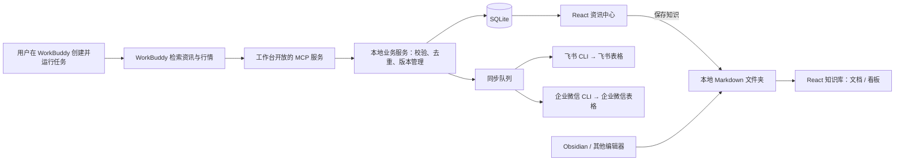

# 股票资讯与知识工作台 · 项目说明文档

版本：V1.1｜日期：2026-10-05｜状态：开发基线，尚未实现应用或连接真实数据。

本文件取代此前《产品架构.md》，是后续开发的统一依据。产品范围已确认；文中标为“建议”的参数与技术细节是开发默认值，外部工具兼容性需要联调验证。

## 1. 产品定位

一个个人使用的本地股票工作台：早盘阅读重点板块资讯，收盘查看资金、涨跌及事件原因，通过 Markdown 知识库积累研究资料，并自动将结果同步到飞书和企业微信表格。

### 核心决策

1. 仅保留两个主模块：**资讯中心、知识库**。连接器与运行记录放在辅助设置中。
2. 资讯中心包含两种不同视图：**早盘资讯、收盘复盘**。
3. 早盘由 AI 每天选择并排列10个重点板块，每板块精选最多10条资讯，默认最多100条。板块每天可以不同。
4. 收盘同时展示**涨幅榜与跌幅榜**，以及板块资金流向、板块涨跌、关注个股、涨停/跌停/热点原因。
5. **任务、提示词和定时执行配置在 WorkBuddy。**本地工作台开放 MCP 服务供 WorkBuddy 写入，不负责创建或调度 WorkBuddy 任务。
6. React 构建界面，SQLite 保存资讯、行情与历史记录。知识正文保存在本地 Markdown 文件夹，可选择 Obsidian 库目录。
7. 通过**飞书 CLI（lark-cli）与企业微信 CLI（wecom-cli）**实现表格同步，两端可分别开启。

### 最新范围调整（2026-10-05）

- 按用户要求移除手动添加资讯按钮与录入流程。资讯统一由 WorkBuddy 经 MCP 写入。
- 资讯操作仅保留删除、获取更多资讯。取消手动添加、编辑、锁定、保留和替换。获取结果经 MCP 校验、去重后直接追加，不占自动精选的10条额度。
- 本机 WorkBuddy 5.5.6 的 task 链接仅支持预填任务，仍需在 WorkBuddy 点发送；不得将打开应用标记为采集成功。
- 左侧资讯卡片采用紧凑高度、单行摘要预览，完整标题保持可读。
- 界面移除装饰性小标题、副标题、口号和重复状态提示，改为紧凑标签与列表详情分栏。

### 第一版不做

交易下单、实时行情终端、多用户协作、云端账户系统、工作台内置 AI 调度平台、完整 Obsidian 插件兼容、默认抓取网页全文/图片/视频、远程表格双向编辑合并。

## 2. 正确的数据链路



- 搜索/行情工具负责获取外部数据，工作台 MCP 负责接收和管理数据，二者不能混为一谈。
- SQLite 是资讯和行情的主数据源，飞书/企业微信表格是便于查看的同步副本。
- Markdown 文件是知识正文主数据源，SQLite 中的知识索引可重建。
- WorkBuddy 入库与表格同步分离：本地入库成功后生成同步任务，云端失败不回滚本地记录。
- 本地服务需要运行，WorkBuddy 才能连接 MCP；同步队列在服务运行且网络可用时处理，恢复启动后继续处理积压任务。

## 3. 页面与视觉

```text
股票工作台
├── 资讯中心
│   ├── 早盘资讯：板块排名 → 新闻列表 → 内容与来源
│   └── 收盘复盘：板块表现 / 涨幅榜 / 跌幅榜 / 涨停股 / 我的关注
├── 知识库
│   ├── 文档：目录、搜索、Markdown 阅读
│   └── 看板：按主题分组的知识卡片
└── 设置（辅助入口）
    ├── MCP 接入说明与数据接收记录
    ├── 飞书 / 企业微信连接、目标表格和同步状态
    └── 知识库目录、存储与备份
```

沿用用户选定图二：浅灰侧栏、白色内容区、蓝紫色选中态、细边框、列表与详情分栏。视觉参考为 [已选资讯中心原型](prototypes/v1/02-news.png)。旧原型中的独立自选、历史复盘等导航不属于当前范围。

全局保留日期、市场、早盘/收盘切换、数据截至时间与状态。默认选择最近有记录日期；用户主动选择空日期显示“暂无记录”，不能悄悄切换。历史版本可查看。行情涨红跌绿，零值为中性色，缺失值为“—”。

收盘首页并列展示涨幅前N名与跌幅前N名摘要，点击可切换完整表格，避免跌幅榜被隐藏。建议默认各10名，N可配置；板块表与“我的关注”在同一收盘视图内切换。

## 4. 早盘资讯

### 4.1 板块排名表

AI 依据近24小时的事件重要性、影响范围、时效性与来源可靠性，选择10个重点板块并排序。这是**资讯关注优先级**，不是行情涨幅排名。行业、主题、概念需保留类别与稳定标识。

| 字段 | 含义 |
| --- | --- |
| 关注排名 | 1～10，同一报告内唯一 |
| 板块名称 | 当日AI选出的行业或主题 |
| 关注理由 | 为什么今天值得关注 |
| 核心新闻 | 板块内第一条精选标题 |
| 资讯数量 | 精选与用户补充的数量 |

### 4.2 板块内资讯表

| 字段 | 必填 | 说明 |
| --- | --- | --- |
| 新闻排名 | 精选是 | 板块内1～10 |
| 标题 | 是 | 简洁事件标题 |
| 资讯概要 | 是 | 2～3句话说明原文事实 |
| 来源名称 | 是 | 发布机构或媒体 |
| 原始链接 | 是 | http/https原文地址 |
| 发布时间 | 是 | 不能用抓取时间代替 |
| 获取时间 | 是 | 实际获取时间 |
| AI解读 | 否 | 与事实摘要分开 |
| 关联股票 | 否 | 名称、代码、交易所 |
| 标签 | 否 | 政策、业绩、订单、技术等 |
| 补充来源 | 否 | 同事件其他报道 |
| 核验状态 | 是 | 原文已读取 / 仅摘要可见等 |

同一事件多篇报道可以合并，保留各自来源；相同原文跨板块关联，正文不重复复制。缺少可核实发布时间或可靠原文的消息不进自动精选。证据不足时宁缺毋滥，允许少于10个板块或每板块少于10条，并展示实际覆盖情况。

### 4.3 用户调整

- 初次提交直接展示精选，无需用户先选择候选。
- 获取更多资讯每批最多10条，经校验与去重后直接追加，无候选选择环节。
- 点击按钮打开 WorkBuddy 并预填任务；用户发送后由 WorkBuddy 调用 MCP 完成检索和入库。自动发送尚未接通。
- 请求固定原报告日期与时间范围；迟到回传不能写入当前浏览的其他日期。
- 删除从该日期/板块池移除并记录排除，历史版本仍可查看；同池再次导入不自动恢复，不自动补位。
- 自动更新保留已追加资讯并去重；原板块退榜时保留补充资讯的历史入口。

## 5. 收盘复盘

收盘是独立的数据报告，主要展示结构化行情与原因，不是把早盘新闻列表换一个标题。报告按目标市场交易日归档，记录数据截至时间。

### 5.1 板块表现表

| 字段 | 说明 |
| --- | --- |
| 板块名称与分类体系 | 行业/概念及分类提供方 |
| 涨跌幅、涨跌排名 | 同一统计范围下比较 |
| 成交额、货币 | 保存数值与单位 |
| 资金净流入、资金口径 | 例如某来源主力净流入；允许缺失 |
| 上涨/下跌/平盘家数 | 缺失不能写成0 |
| 涨停/跌停家数 | 来源可提供时展示 |
| 代表个股 | 关联具体股票 |
| 热点或回落原因 | 事实与AI分析分开 |
| 依据链接 | 公告、新闻或数据页面 |
| 来源与截至时间 | 明确行情出处 |

不同提供方、不同计算口径的资金数据不能直接混排。缺少资金流向时保留涨跌等其他数据并明确显示缺失，不由AI估算填充。

### 5.2 个股表现表：涨幅榜与跌幅榜均为核心

| 字段 | 说明 |
| --- | --- |
| 榜单类型与排名 | 涨幅榜降序，跌幅榜升序 |
| 股票代码、交易所、名称 | 代码+交易所唯一识别 |
| 所属板块 | 支持多个板块 |
| 收盘价、货币 | 当日收盘数据 |
| 涨跌幅 | 有明确基准和口径 |
| 成交额、换手率 | 展示交易活跃程度 |
| 资金净流入及口径 | 可选 |
| 涨跌停状态 | 收盘涨停/跌停、盘中触及、未触及、不适用、未知 |
| 连板数 | 可选，需可靠来源 |
| 上涨/下跌/涨停原因 | 不能只解释上涨，跌幅前列也要说明 |
| 依据链接与核验状态 | 支持查看原文，缺乏依据显示原因待核实 |
| 是否关注 | 用户在本地标记 |
| 行情来源与截至时间 | 必须保存 |

建议默认涨幅与跌幅各10名，可配置数量。没有上涨或下跌股票时不强凑该榜单。并列值建议按成交额降序、再按证券标识稳定排序，界面注明采用顺序排名。

必须记录统计范围：市场、股票池、是否含ST/新股/停牌股、提供方与样本覆盖。只获得部分数据时标注“已获取样本排名”，来源只提供前N名时注明“来源前N名”，不得伪装全市场排名。涨跌停阈值不能统一假设为10%。

### 5.3 原因说明

每条原因包含：对象（板块或个股）、类型（热点/上涨/下跌/涨停/跌停/其他异动）、已披露事实、可选AI分析、核验状态、来源列表。无法核实则写“原因待核实”。新闻与行情同时出现不等于确定因果，AI 推测必须标明。

## 6. 知识库

用户选择本地 Markdown 文件夹或已同步到本机的 Obsidian vault。文件留在原处，可继续用 Obsidian 或其他编辑器修改。

第一版：目录、标签、搜索、Markdown阅读、常规表格和图片、按主题分组的卡片看板、资讯保存为新Markdown。

可选 frontmatter：title、tags、date、status、source_urls。没有字段时按文件名和目录展示；没有事件日期时不推断成文件修改日期。卡片可回到原文件和章节。

保存资讯时保留概要、来源、原文链接、发布时间、保存时间，AI解读单列，个人观点留空。使用不冲突的文件名，落盘成功后再更新索引。外部修改、移动、删除后更新索引，不覆盖外部编辑。

第一版优先只读已有文档。常见双链作为兼容目标，无法解析的链接明确提示；不承诺完整Obsidian插件兼容。状态看板、时间线、图谱、AI知识提取与双向编辑后续增加。

知识库不默认向飞书/企业微信同步，防止将私人笔记混入行情分享。第一版云端同步范围仅为资讯和收盘报告。

## 7. 飞书与企业微信连接器

### 7.1 职责与目标

使用本地 `lark-cli` 和 `wecom-cli`，分别作为适配器。两端可独立启停和重试，登录状态和权限独立检测。设置中填写目标表格链接、同步范围、自动同步开关，显示最后成功时间、失败原因和打开表格入口。

飞书第一版目标为电子表格。企业微信根据目标链接区分在线表格/智能表格；未指定类型时建议智能表格，但最终类型需在配置时固定，并验证相应接口能力。不能把两类表格当作同一API。

已读取的本地技能说明显示飞书支持表格读写，企业微信覆盖在线表格及智能表格；这不代表本机已安装、授权或具备目标表格权限。实施时按实际CLI版本、帮助和接口Schema验证，不凭经验拼命令。

### 7.2 自动同步规则

- 用户完成目标配置并开启后，报告发布及用户调整成功时自动入队；也支持立即同步、失败重试。
- SQLite 是主数据源，第一版单向同步到云端；云端手动改动不回写本地。
- 每个目标使用工作台专属工作表/数据表，只写管理范围，不覆盖既有人工表格或笔记列。
- 行级稳定业务键与内容哈希确保重试不重复追加。普通表格不能只记行号：用户排序后需重新按键定位；智能表格保存记录映射并校验。
- 同一目标按版本顺序执行，旧版本任务不得覆盖新版本。报告涉及多张表时，全部写入并回读校验后才更新“已同步版本”；不假设跨云端工作表有事务。
- 本地删除同步为“已移除”状态，不物理删除整张表；默认视图过滤非有效条目，历史可追溯。
- 失败指数退避并限制重试，授权失效转为待用户处理，不无限循环。单端失败不阻塞另一端。
- 报告发布与 outbox 入队同一数据库事务，避免本地成功但同步事件丢失。网络写入超时结果不明时，先读回业务键再决定重试。
- 标题和摘要按文本写入，避免被解释为表格公式；股票代码保持文本前导零，金额/百分比按数值与格式写入，百分比内部口径在适配器中显式转换。
- 同步的是表格，不自动向联系人或群聊发送消息。

### 7.3 云端表格布局

| 工作表/数据表 | 每行表示 | 主要列 |
| --- | --- | --- |
| 每日板块 | 一天一个重点板块 | 日期、市场、板块排名、板块、关注理由、新闻数 |
| 早盘资讯 | 一条板块新闻关联 | 日期、板块、新闻排名、标题、概要、来源、发布时间、原文链接、精选/补充、状态 |
| 收盘板块 | 一天一个板块行情 | 日期、板块、涨跌幅、成交额、资金净流入、资金口径、涨跌家数、热点/回落原因、依据 |
| 个股涨幅榜 | 一只入榜股票 | 日期、排名、代码、名称、板块、收盘价、涨跌幅、成交额、上涨原因、依据 |
| 个股跌幅榜 | 一只入榜股票 | 日期、排名、代码、名称、板块、收盘价、涨跌幅、成交额、下跌原因、依据 |
| 关注个股 | 一只关注股票 | 日期、股票、涨跌幅、资金、异动原因、来源 |

技术列保留业务键、报告版本、更新时间、有效状态，可隐藏展示；每个表保留日期筛选。涨停/跌停状态放在个股数据列，可用筛选查看，避免重复建大量表。行数上限与分页限额开发时实测，按月/年分表可作为增长策略，不假定无限追加。

## 8. 建议技术架构

- React + TypeScript：前端。
- Node.js + TypeScript：本地HTTP服务、MCP服务、业务校验、Markdown索引和CLI适配器。
- SQLite：迁移、外键、事务、WAL与写入队列。
- 同步Worker：读取outbox，通过参数数组调用CLI，输入用结构化JSON或stdin，不拼接用户内容为shell命令。
- 本地文件夹：Markdown原始内容。

前端API、MCP和同步器调用同一业务层，不重复实现去重和保护规则。MCP传输选stdio或本地HTTP，先验证WorkBuddy兼容性再固定。前端不能直接打开SQLite文件。个人单机服务默认仅监听本机；HTTP接口校验身份与来源。凭证使用CLI的凭证机制，不写入提示词、正文或日志。

## 9. 数据库表结构建议

时间戳统一UTC保存，报告日期另按市场时区确定；API时间带时区。金额使用定点/十进制表示并保存单位，百分比明确3.26代表3.26%，缺失值NULL。新闻修订和报告版本不可变，后续更新创建新版本。

| 表 | 核心字段与职责 |
| --- | --- |
| ingestion_runs | 批次唯一键、任务类型、范围、状态、开始/结束时间、错误摘要 |
| daily_reports | 日期、早盘/收盘、市场、版本、检索范围、数据截至时间、运行关联；日期+时段+市场+版本唯一 |
| sectors | 板块稳定标识、名称、行业/概念、分类提供方 |
| sector_focus | 报告、板块、关注排名、理由；报告内板块与排名分别唯一 |
| news_items | 资讯稳定标识、规范原文URL、事件线索 |
| news_revisions | 资讯、标题、概要、AI解读、发布时间、获取时间、核验状态、内容哈希 |
| news_sources | 修订、来源名称、原文URL、发布时间、主/补充来源 |
| sector_news | 重点板块、资讯修订、位置、精选/补充、来源、移除状态 |
| instruments | 股票代码、交易所、名称；代码+交易所唯一 |
| news_instruments | 资讯修订与股票关联 |
| instrument_sectors | 股票、板块、归属日期，避免历史分类被当前分类覆盖 |
| sector_daily_stats | 报告、板块、涨跌幅、成交额、资金、口径、涨跌平盘家数、涨跌停数、来源、截至时间 |
| stock_daily_stats | 报告、股票、收盘价、涨跌幅、成交额、换手率、资金、口径、涨跌停状态、连板数、来源、截至时间 |
| ranking_scopes | 报告、榜单类型、股票池、过滤条件、覆盖范围、提供方、来源排名 |
| event_explanations | 报告、板块或股票、原因类型、事实摘要、AI分析、核验状态 |
| explanation_sources | 原因、来源名称、URL、发布时间、可选资讯修订引用 |
| watchlist | 关注股票及添加时间 |
| supplemental_requests | 日期、板块/股票/主题、查询、时间范围、状态；供WorkBuddy读取 |
| supplemental_news | 请求、资讯修订、顺序、追加完成状态；承接个股与主题任务，不强占每日板块 |
| pool_actions | 范围、删除、条目、版本、操作时间；排除与审计 |
| knowledge_roots / knowledge_files | 授权目录、相对路径、内容哈希、标题、标签、日期、索引状态 |
| knowledge_exports | 资讯修订与导出Markdown文件关联 |
| connector_configs | 平台、目标资源、表类型、启用状态、字段映射；不保存明文密钥 |
| sync_outbox | 目标、报告版本、事件、幂等键、待处理状态；与业务提交事务写入 |
| sync_jobs / sync_row_map | 尝试次数、错误、回读结果；本地业务键与远程行/记录映射 |

按日期、报告、板块、股票、发布时间建索引。全文搜索可选FTS5，但中文标题和标签的检索效果需实际验收。外部文件路径必须约束在授权目录，Markdown渲染清理不可信HTML。

## 10. MCP工具契约草案

以下工具均待开发，不代表已有可调用接口。MCP不开放任意SQL、任意本地文件或任意CLI命令执行。

| 工具 | 输入 | 行为 |
| --- | --- | --- |
| get_ingestion_schema | 可选版本 | 返回字段、枚举、数量和来源要求 |
| get_report_context | 日期、时段、市场 | 返回当前版本、已入库资讯和排除项 |
| begin_ingestion | 外部批次编号、类型、日期、市场、时间范围 | 创建或恢复接收批次 |
| submit_morning_report | 运行标识、内容哈希、重点板块及新闻 | 校验并暂存早盘数据 |
| submit_close_report | 运行标识、范围、板块/个股行情、原因 | 校验并暂存收盘数据 |
| get_supplement_request | 请求标识 | 返回冻结的补充范围与排除项 |
| submit_supplement | 运行、请求、批次、资讯 | 去重并直接追加补充资讯 |
| finish_ingestion | 运行标识 | 事务发布有效结果与同步outbox，返回版本和数量 |
| fail_ingestion | 运行标识、错误 | 记录失败，保留旧成功报告 |

同批次同内容重试不能新增副本；同批次不同内容返回冲突。中途失败不标记完整成功，允许部分覆盖但必须显示警告。发布前再次检查最新用户操作，版本冲突不能静默覆盖。提交成功与表格同步成功分别返回状态。

### 早盘消息示例（仅演示结构，不是完整100条）

```json
{
  "schema_version": "1.0",
  "date": "2026-09-30",
  "market": "CN_A",
  "window_start": "2026-09-29T08:30:00+08:00",
  "window_end": "2026-09-30T08:30:00+08:00",
  "sectors": [{
    "sector_key": "custom:semiconductor",
    "name": "半导体",
    "attention_rank": 1,
    "reason": "示例关注理由",
    "news": [{
      "rank": 1,
      "title": "示例事件标题",
      "summary": "来自原文的事实概要。",
      "published_at": "2026-09-30T07:00:00+08:00",
      "fetched_at": "2026-09-30T08:20:00+08:00",
      "verification": "full_text_read",
      "sources": [{"name": "示例来源", "url": "https://example.com/news/1", "is_primary": true}],
      "ai_analysis": null,
      "related_stocks": []
    }]
  }]
}
```

收盘提交复用报告字段，增加 `data_as_of`、`ranking_scopes[]`、`sector_stats[]`、`stock_stats[]`、`explanations[]`。每条行情有provider、source_url和as_of；资金有flow_method；原因包含对象和多来源。第一阶段固化严格JSON Schema与正反例测试夹具。

## 11. 主要界面操作与状态

前端API覆盖日期/版本查询、早盘排序、行情榜单、资讯详情、补充请求、删除、关注股票、知识文件、导出与同步状态。

写入携带预期版本，删除与追加使用事务处理。必须展示：无数据、接收中、部分完成、成功、失败、空日期、行情字段缺失、原文失效、知识目录不可访问、连接未授权、表格同步失败。不能因配置存在就显示“已连接”，不能因CLI返回请求成功就声称数据已核验同步。

## 12. 存储、备份与维护

长期保存资讯、行情、报告版本与用户操作。运行日志可配置保留期限，正式入库资讯不随临时清理删除。默认仅存文字、链接及结构化数值，容量以实际监控为准，设置展示数据库、索引与备份大小。

SQLite使用一致性备份，不能只复制仍在写入的主库而忽略WAL。Markdown另行备份，数据库备份不能替代原文件。恢复后校验报告数量、版本、同步游标；同步任务重放仍需幂等。

## 13. 开发阶段

1. **契约与数据闭环**：React/本地服务骨架、SQLite迁移、MCP握手、Schema、测试客户端入库，验证WorkBuddy真实提交。
2. **资讯中心**：两模块导航、早盘10×10、收盘涨跌双榜、资金及原因、日期/版本、来源跳转、用户整理操作。
3. **知识库**：授权目录、Markdown阅读搜索、主题卡片、外部变更索引、资讯导出。
4. **双平台同步**：飞书与企业微信授权检测、目标配置、字段映射、outbox、幂等更新、回读和失败恢复。两端均属于第一版目标，不省略企业微信。
5. **真实数据联调**：来源口径、市场范围、部分失败、并发、备份恢复、中文搜索与页面检查。

建议初始市场为A股，其他市场保留结构支持，接入时分别确认时间与行情规则。首批任务先在WorkBuddy运行，工作台只验证接收与同步。

## 14. 验收清单

- [ ] 10个板块各10条合格资讯可入库展示，所有自动资讯有可追溯来源与链接。
- [ ] 次日板块可变，昨日榜单和内容版本不变；空日期正确展示。
- [ ] 重复提交无重复记录；失败重试可恢复，旧报告不丢失，部分结果明确标记。
- [ ] 用户删除不被同池重抓恢复；追加资讯不被自动覆盖；重复提交不重复入库。
- [ ] 补充结果直接追加，可超过初始每板块10条上限。
- [ ] 收盘涨幅前N与跌幅前N均可查看，排序正确，双方都有原因或明确的待核实状态。
- [ ] 资金缺失不是0，不同口径不混排；样本排名与全市场排名区分。
- [ ] 事实与AI推测分开，热点/异动依据可点击。
- [ ] Markdown外部修改后索引更新，导出不覆盖原文件，未授权路径不可读取。
- [ ] 飞书和企业微信都能同步并回读验证；失败各自独立，不影响本地入库。
- [ ] 同步重试不重复追加，远程排序后仍能按业务键更新，旧版本不会覆盖新版本。
- [ ] 删除状态同步正确，不破坏目标表中非管理区域与人工列。
- [ ] 股票代码前导零保留，百分比与金额为正确数值类型，标题不会被当作公式执行。
- [ ] 备份恢复后数据和用户操作完整，同步重放保持幂等。

## 15. 集成待核实项

开发前实测：WorkBuddy支持的MCP传输、真实资讯与行情源的权限/覆盖/口径、两个CLI安装与授权、目标表格类型和写权限、知识库目录。尚未指定云端目标或授权，不应在开发文档交付时自动创建表格或发送消息。

以上是集成配置项，不影响先用示例数据开展本地开发。真实工具能力与本文建议不一致时记录差异，不伪造成功状态。
